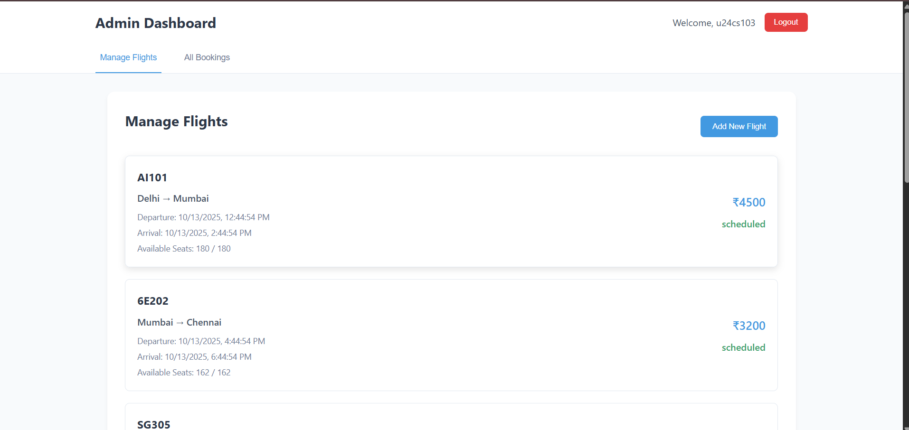
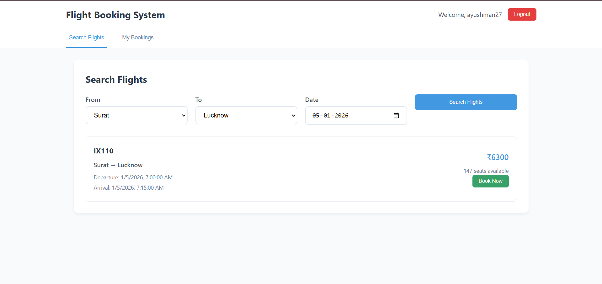

# 🚂 Train Booking System 🎫

This project is a full-stack train booking system that allows users to search for trains, manage bookings, and handle user authentication. Administrators can manage trains and view all bookings. It provides a seamless experience for both users and administrators to interact with the train booking service.

## 🌟 Key Features

- **User Authentication:** Secure user registration and login with JWT-based authentication.
- **Train Search:** Users can search for trains based on source station, destination station, and date.
- **Booking Management:** Users can view and manage their train bookings.
- **Admin Dashboard:** Administrators can manage trains (add, update, delete) and view all bookings.
- **Real-time Data Validation:** Utilizes Pydantic for data validation, ensuring data integrity.
- **Secure Password Handling:** Employs `passlib` for secure password hashing.
- **CORS Support:** Configured to allow requests from frontend origins, enhancing security.

## 🛠️ Tech Stack

- **Frontend:**
  - React: Core UI library.
  - React Router DOM: For routing and navigation.
  - Axios: HTTP client for making API requests.
  - Context API: For managing authentication state.
- **Backend:**
  - FastAPI: Web framework for building the API.
  - SQLAlchemy: ORM for database interactions.
  - Pydantic: For data validation and settings management.
  - `passlib`: For password hashing.
  - `python-jose`: For JWT encoding and decoding.
- **Database:**
  - SQLite: Lightweight database for storing user, train, and booking data.
- **Authentication:**
  - JWT (JSON Web Tokens): For secure authentication and authorization.
- **Build Tools:**
  - Vite: For frontend development and bundling.

## 📦 Getting Started

### Prerequisites

- Node.js (v16 or higher)
- Python (v3.8 or higher)
- pip (Python package installer)

### Installation

1.  **Clone the repository:**

    ```bash
    git clone <repository_url>
    cd <repository_directory>
    ```

2.  **Backend Setup:**

    ```bash
    cd backend
    python -m venv venv
    source venv/bin/activate  # On Windows: venv\Scripts\activate
    pip install -r requirements.txt
    ```

3.  **Frontend Setup:**

    ```bash
    cd frontend
    npm install
    ```

### Running Locally

1.  **Start the Backend:**

    ```bash
    cd backend
    uvicorn main:app --reload
    ```

    This will start the FastAPI server, typically on `http://127.0.0.1:8000`.

2.  **Start the Frontend:**

    ```bash
    cd frontend
    npm run dev
    ```

    This will start the React development server, typically on `http://localhost:5173`.

## 💻 Project Structure

```
📂 TrainBookingSystem
├── 📁 backend
│   ├── 📜 auth.py
│   ├── 📜 database.py
│   ├── 📜 main.py
│   ├── 📜 models.py
│   ├── 📜 requirements.txt
│   └── 📁 venv
├── 📁 frontend
│   ├── 📁 public
│   ├── 📁 src
│   │   ├── 📜 App.css
│   │   ├── 📜 App.jsx
│   │   ├── 📁 components
│   │   │   ├── 📜 AdminDashboard.jsx
│   │   │   ├── 📜 Login.jsx
│   │   │   ├── 📜 Register.jsx
│   │   │   └── 📜 UserDashboard.jsx
│   │   ├── 📁 contexts
│   │   │   └── 📜 AuthContext.jsx
│   │   ├── 📜 index.css
│   │   └── 📜 main.jsx
│   ├── 📜 .gitignore
│   ├── 📜 package.json
│   ├── 📜 vite.config.js
│   └── 📜 node_modules
├── 📜 .gitignore
└── 📜 README.md
```

## 📸 Screenshots



